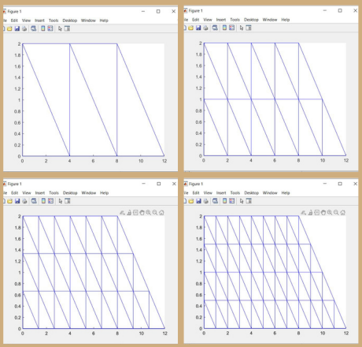
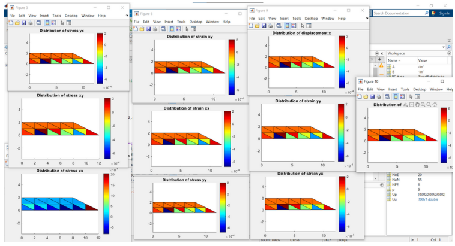

# Finite-Element-Method-Analysis
This project uses MATLAB to perform finite element analysis 2D surfaces under stress or strain.

# Explaination

## Discretization
The disc file does the discretization for the body. The user can choose the value of 'i' to decide the number of subdivisions.
Below is an image of the discretization with different values of i.

## Calculations
The calucation of the stiffness matrix, assembly of forces, boundary conditions, etc. are taken care of by in their respective function files.

## Post Processing
This helps plot the stresses, strains and deformations for the body and better visualize it.
Below is the result for one value of i.

